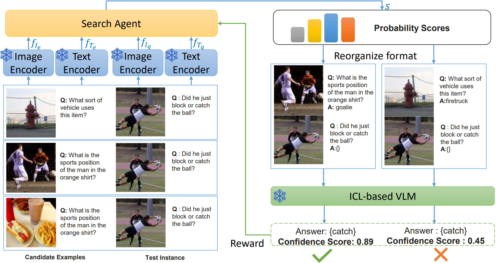

# Adaptive Multi-modal Search Model for VQA

This project introduces an Adaptive Multi-modal Search Model (AMSM) for example selection in Visual Question Answering (VQA) tasks. Through Token-level Confidence Scoring and multi-modal feature fusion, our method effectively selects appropriate context examples for query samples.

## Key Features

- Token-level Confidence Scoring: A fine-grained evaluation mechanism based on language model token-level predictions
- Adaptive Multi-modal Search: Example selection strategy combining visual and textual features
- End-to-end Training: Complete training and evaluation pipeline from example selection to downstream VQA tasks

<br>
    
<br>

## Environment Setting
1. Create conda environment

```bash
conda create -n AMSM python=3.8
conda activate AMSM
```

2. Build from source
```bash
git clone https://github.com/LouisJacky/ICL_AMSM
cd ICL_AMSM
pip install -e .
```

3. Download 'cococaption' folder from [this link](https://drive.google.com/drive/folders/1nya7F-055ExZcnwSUMuWB9gtMmQbAO2L?usp=drive_link) and put it under 'RL_base' folder.

## VLM
**OpenFlamingo** is a multimodal language model that can be used for a variety of tasks. It is trained on a large multimodal dataset (e.g. Multimodal C4) and can be used to generate text conditioned on interleaved images/text. You can read its [blog](https://laion.ai/blog/open-flamingo-v2/) and [code](https://github.com/mlfoundations/open_flamingo) for more information. 


OpenFlamingo combines a pretrained vision encoder and a language model using cross attention layers. In our experiment, we use [OpenFlamingo-9B]() for experiments. which uses pretrained vision encoders from the [OpenCLIP](https://github.com/mlfoundations/open_clip) package, [ViT-L-14](https://huggingface.co/openai/clip-vit-large-patch14), and uses the [MPT-7B](https://huggingface.co/mosaicml/mpt-7b) as the pretrained language models. Initialize the model as above and use the following code.
``` python
from open_flamingo import create_model_and_transforms

model, image_processor, tokenizer = create_model_and_transforms(
    clip_vision_encoder_path="ViT-L-14",
    clip_vision_encoder_pretrained="openai",
    lang_encoder_path="anas-awadalla/mpt-7b",
    tokenizer_path="anas-awadalla/mpt-7b",
    cross_attn_every_n_layers=4
)

# grab model checkpoint from huggingface hub
from huggingface_hub import hf_hub_download
import torch

checkpoint_path = hf_hub_download("openflamingo/OpenFlamingo-9B-vitl-mpt7b", "checkpoint.pt")
model.load_state_dict(torch.load(checkpoint_path), strict=False)
```

## Datasets
We use [OK-VQA](https://okvqa.allenai.org/download.html), [VizWiz](https://vizwiz.org/tasks-and-datasets/vqa/) for VQA, [COCO2014](https://cocodataset.org/#download) for captioin,and [Tiny ImageNet](https://paperswithcode.com/dataset/tiny-imagenet) for classification. You need to download the files of these datasets yourself, including the Images and Annotations. 


## Main Files

### label_vqa.py

Implements Token-level Confidence Scoring to evaluate example pair matching.

<!--
```python
def get_word_confidence(ofv2_model, device, query_image, query_question, target_answer,
                      example_image, example_question, example_answer,
                      tokenizer, image_processor):
    # Build prompt
    prompt = f"<image>Question:{example_question} Short answer:{example_answer}.<|endofchunk|><image>Question:{query_question} Short answer:{target_answer}."
    
    # Calculate prediction probability for each token
    outputs = ofv2_model(vision_x=vision_x, lang_x=prompt_tokens.input_ids)
    logits = outputs.logits[:, -target_length-2:-2, :]
    
    # Calculate average confidence score
    target_probs = []
    for i in range(target_length):
        token_probs = probs[0, i] 
        target_token_id = target_tokens[0, i].item()
        target_prob = max(token_probs[target_token_id].item(), 1e-10)
        target_probs.append(target_prob)
        
    avg_confidence = sum(target_probs) / len(target_probs)
    return avg_confidence
```
--> 


Required path configurations:
```python
parser.add_argument('--lm_path', default="/path/to/mpt-7b")
parser.add_argument('--lm_tokenizer_path', default="/path/to/mpt-7b")
parser.add_argument('--checkpoint_path', default="/path/to/ofv2/checkpoint.pt")
parser.add_argument('--train_image_dir', default="/path/to/ok_vqa/train2014")
parser.add_argument('--test_image_dir', default="/path/to/ok_vqa/val2014")
parser.add_argument('--okvqa_train_questions_json_path', 
                    default="/path/to/OpenEnded_mscoco_train2014_questions.json")
parser.add_argument('--okvqa_train_annotations_json_path',
                    default="/path/to/mscoco_train2014_annotations.json")
parser.add_argument('--features_file',
                    default="/path/to/texts_features.h5")
```


### train_vqa.py

Trains the Adaptive Multi-modal Search Model.

<!--
```python
# Load image and text encoders
clip_model, image_preprocess = clip.load(args.clip_type, device=device)

# Initialize policy model
policy_model = AdaptiveMultiModalMatchingModel(
    clip_model,
    hidden_size=args.policy_feature_dim,
    Modal=args.Modal
).to(device)

# Training loop
for epoch in range(start_epoch, args.epochs):
    for batch in dataloader:
        # Process multi-modal inputs
        query_images = preprocess_batch(batch['query_image'], image_preprocess)
        example_images = preprocess_batch(batch['example_image'], image_preprocess)
        
        # Forward pass and loss calculation
        outputs = policy_model(query_images, query_questions, example_images, example_questions)
        loss = custom_loss(outputs, labels, args.candidate_num)
```
-->

Required path configurations:
```python
parser.add_argument('--json_file',
                    default='/path/to/okvqa_labeled_confidence.json')
parser.add_argument('--image_dir',
                    default="/path/to/ok_vqa/train2014")
parser.add_argument('--output_root',
                    default='../log/ofv2_base/END_OUTPUT_linear')
```


### eval_vqa.py

Evaluation process in two stages:

1. Example Retrieval: Uses trained policy model to select best examples for test samples
2. VQA Scoring: Completes VQA task using selected examples and VLM model, then calculates performance

<!--
```python
def main():
    # Stage 1: Example Retrieval
    policy_model = load_trained_policy_model(args.policy_model_checkpoint)
    best_examples = evaluate_policy_model(policy_model, test_dataloader, train_dataloader)
    
    # Stage 2: VQA Scoring
    ofv2_model = create_model_and_transforms()
    score_main(args, ofv2_model, image_processor, tokenizer)
```
-->

Required path configurations:
```python
parser.add_argument('--lm_path', default="/path/to/mpt-7b")
parser.add_argument('--lm_tokenizer_path', default="/path/to/mpt-7b")
parser.add_argument('--checkpoint_path', default="/path/to/checkpoint.pt")
parser.add_argument('--policy_model_checkpoint',
                    default="/path/to/policy_model_checkpoint.pth")
```


## Usage

1. First, run label_vqa.py to calculate Token-level Confidence scores for training data:
```bash
python label_vqa.py --lm_path /path/to/mpt-7b --train_image_dir /path/to/train2014
```


2. Use train_vqa.py to train the Adaptive Multi-modal Search Model:
```bash
python train_vqa.py --json_file /path/to/labeled_data.json --image_dir /path/to/train2014
```


3. Run eval_vqa.py for testing and evaluation:
```bash
python eval_vqa.py --policy_model_checkpoint /path/to/model.pth
```
4. For Caption and Classification tasks, similar label-train-eval files can be found in the RL_base folder.


